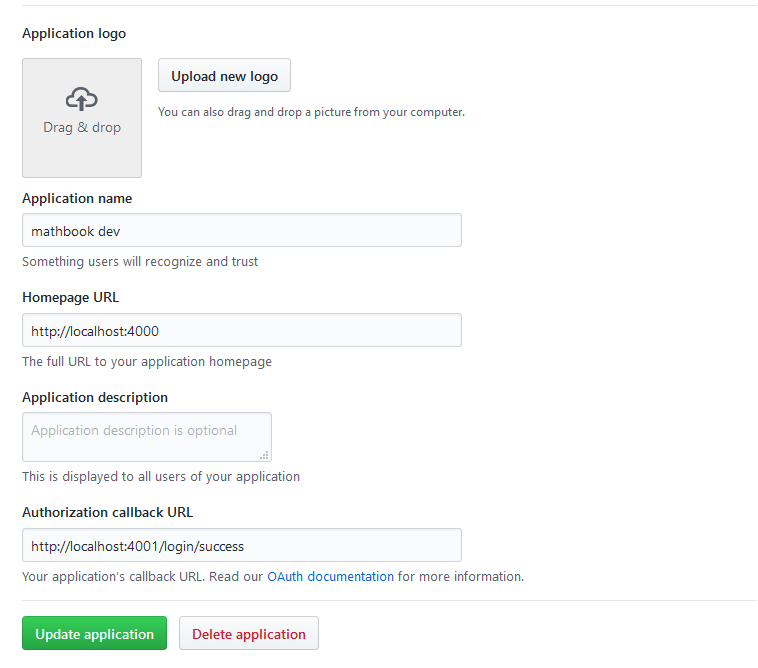

# Mathbook

[](https://travis-ci.org/JetJet13/mathbook)
[](https://greenkeeper.io/)
[](https://gitter.im/mathbook-chat/Lobby)

Mathbook is a website that provides peer-reviewed tutorials on topics covering most subjects in mathematics.

Mathbook is written in JavaScript and built using NodeJS, ExpressJS, Riot and Pug (formerly known as Jade)

## Requirements

* Node 8.x
* Redis 4.x

## Installation & Setup

```bash
git clone https://github.com/JetJet13/mathbook.git

cd ./mathbook

npm i
```

To install and start up a Redis Server

```bash
# linux users
wget http://download.redis.io/redis-stable.tar.gz
tar xvzf redis-stable.tar.gz
cd redis-stable
make
make test
make install

# mac osx users
brew install redis


# to startup redis server
redis-server
```

## Run Locally

**Note**: You might need to install gulp and bunyan globally first

```bash
npm i -g gulp-cli bunyan
```

```bash
gulp serve

# if you want pretty log formatting (linux/macOS users only)
gulp serve | bunyan
```

If you want to get the GitHub OAuth Login functionality working, you will need to do the following,

1. Visit github.com and Sign In
2. Navigate to your profile settings page
3. In the side bar, find and click on `Developer Settings`
4. Then click on `New OAuth App`
5. You will then be navigated to a page that looks similar to this,



6. Confirm that the `Homepage URL` and `Authorization callback URL` you entered match what you see in the screenshot
   above.
7. Click `Update Application`
8. Now, copy the `clientId` and `clientSecret` for your newly created Application into your `config/local.json` file.

Your `local.json` file should look something like the following,

```json
{
  "bin": {
    "protocol": "http",
    "host": "127.0.0.1",
    "port": 4000,
    "domain": "localhost",
    "proxyPort": 4001
  },

  "github": {
    "clientId": "<CLIENT_ID>",
    "clientSecret": "<CLIENT_SECRET>"
  },
  "redis": {
    "host": "127.0.0.1",
    "port": 6379,
    "password": "<REDIS_PASSWORD>"
  }
}
```

## Testing

```bash
# run all tests
gulp test
```

**Note**: if the above test commands fail, you might need to install gulp and bunyan globally

## Contributing

If you are interested in contributing please refer to [CONTRIBUTING.md](./CONTRIBUTING.md)

## Contributors

If you are looking for the list of Contributors of Mathbook, please refer to [contributors.md](./contributors.md)

## License

Mathbook is Open Source and Licensed under MPL-2.0 Please refer to [LICENSE](./LICENSE) for more info.
